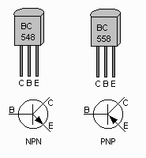
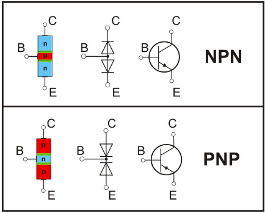
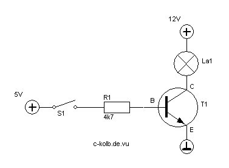
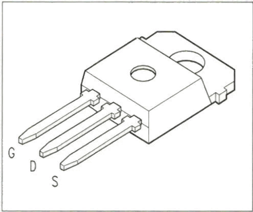
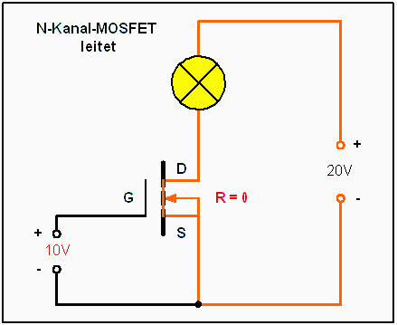
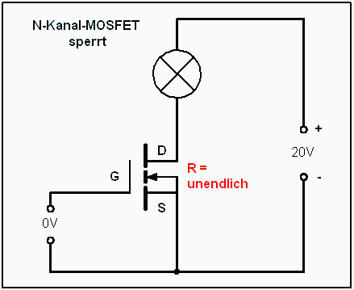

### Kondensatoren

- Parallel geschaltete Kondensatoren addieren ihre Kapazität C: 
```
	Cg = C1 + C1
```
- In Reihe geschaltete Kondensatoren addieren ihre Spannung U und an jedem Kondesator fällt dabei dieselbe Ladungsmenge Q ab 
```
	Ug = U1 + U2 und Q1 = Q2, wobei Qi = Ui * Ci  
```
  - Wie ergibt sich die Spitzenspannnug Umax bei gegebener Spannung U:
```
	Umax = (U + U/10) * sqrt(2)
```
  - Energie des Einschaltstroms hängt ab von der Kapazität C der Eingangskondensatoren
```
	E = ( C * Umax * Umax ) / 2
``` 
  Kapazität C in Farad (F), Spitzenspannung Umax in Volt (V), ergibt Energie in Joule (J)

   *Beispiel:*
```
	U = 12V => Umax = 18.668V, Imax = 22A => Rmin = 0.85Ω
```
Wenn 4 parallel, geschaltete Eingangskondensatoren mit jeweils 470µF verwendet werden, ergibt sich:
```
	E = 1/2 * (4*470 * 10^(-6)) * 18.668^2 = 0.33J
```
Wenn 4 parallel, geschaltete Eingangskondensatoren mit jeweils 2700µF verwendet werden, ergibt sich:
```
	E = 1/2 * (4*2700 * 10^(-6)) * 18.668^2 = 1.88J
```

- Welcher Widerstand Rmin (Ω) wird benötigt um den Strom auf Imax (A) zu beschränken:
```
	Rmin = Umax / Imax
```
## Transistoren

- Belegung




- Einfache Schaltung ([Beispiele zur Widerstandsberechnung](http://c-kolb.bplaced.net/projekte/elektronik/grundlagen/widerstand/transistor.php))




## MOSFETs

- Gängige (aber nicht zwingende) Belegung



- Verdrahtung eines durchgeschalteten N-Kanal MOSFET



- Verdrahtung eines sperrenden N-Kanal MOSFET

